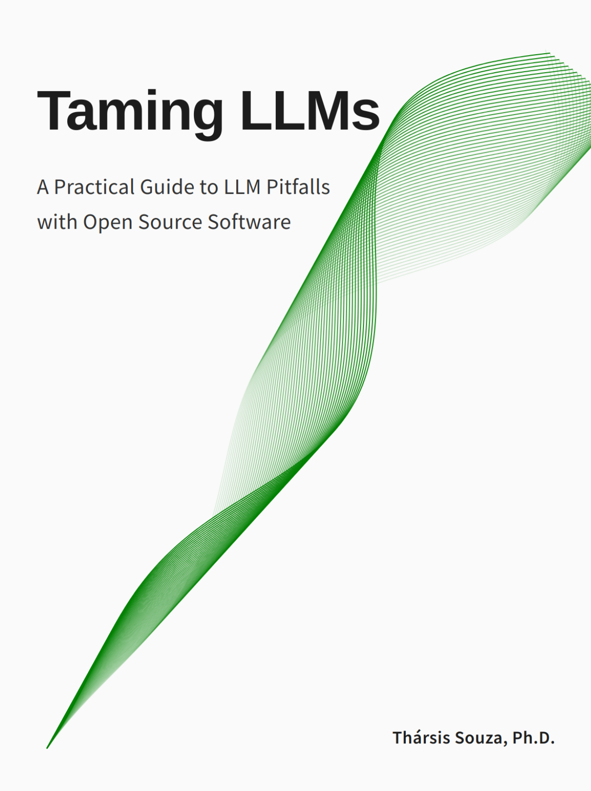

Receive updates on [new Chapters here](https://tamingllm.substack.com/).

 <a href="https://www.souzatharsis.com/tamingLLMs" target="_blank">
  
 </a>

Please [open an issue](https://github.com/souzatharsis/tamingLLMs/issues) with your feedback or suggestions!

# [Taming LLMs](https://www.souzatharsis.com/tamingLLMs)
*Publication Date: February 2, 2025*
### *A Practical Guide to LLM Pitfalls with Open Source Software*

Abstract: *The current discourse around Large Language Models (LLMs) tends to focus heavily on their capabilities while glossing over fundamental challenges. Conversely, this book takes a critical look at the key limitations and implementation pitfalls that engineers and technical leaders encounter when building LLM-powered applications. Through practical Python examples and proven open source solutions, it provides an introductory yet comprehensive guide for navigating these challenges. The focus is on concrete problems with reproducible code examples and battle-tested open source tools. 

By understanding these pitfalls upfront, readers will be better equipped to build products that harness the power of LLMs while sidestepping their inherent limitations.*

| Chapter                                   | Website      | Notebook      | Status               |
|-------------------------------------------|--------------|---------------|----------------------|
| Preface                   | [html](https://www.souzatharsis.com/tamingLLMs/markdown/preface.html) | N/A           | *Ready for Review*                   |
| About the Book                  | [html](https://www.souzatharsis.com/tamingLLMs/markdown/intro.html) | N/A           | *Ready for Review*                   |
| Chapter 1: Wrestling with Structured Output| [html](https://www.souzatharsis.com/tamingLLMs/notebooks/structured_output.html) | [ipynb](https://github.com/souzatharsis/tamingLLMs/blob/master/tamingllms/notebooks/structured_output.ipynb) | *Ready for Review*     |
| Chapter 2: The Input Data Challenge      |              |               |                  |
| Chapter 3: Output Size Limitations       | [html](https://www.souzatharsis.com/tamingLLMs/notebooks/output_size_limit.html) | [ipynb](https://github.com/souzatharsis/tamingLLMs/blob/master/tamingllms/notebooks/output_size_limit.ipynb) | *Ready for Review*    |
| Chapter 4: The Evals Gap                 | [html](https://www.souzatharsis.com/tamingLLMs/notebooks/evals.html) | [ipynb](https://github.com/souzatharsis/tamingLLMs/blob/master/tamingllms/notebooks/evals.ipynb) | *Ready for Review*     |
| Chapter 5: Safety Concerns               | [html](https://www.souzatharsis.com/tamingLLMs/notebooks/safety.html)  |  [ipynb](https://github.com/souzatharsis/tamingLLMs/blob/master/tamingllms/notebooks/safety.ipynb) | *Ready for Review*     |
| Chapter 6: Preference-Based Alignment     | [html](https://www.souzatharsis.com/tamingLLMs/notebooks/alignment.html) | [ipynb](https://github.com/souzatharsis/tamingLLMs/blob/master/tamingllms/notebooks/alignment.ipynb) | *Ready for Review*     |
| Chapter 7: Breaking Free from Cloud-Based Models |   [html](https://www.souzatharsis.com/tamingLLMs/notebooks/local.html) | [ipynb](https://github.com/souzatharsis/tamingLLMs/blob/master/tamingllms/notebooks/local.ipynb) | *Ready for Review*     |
| Chapter 8: The Cost Factor                |              |               |                 |
| Chapter 9: Frontiers                |              |               |     WIP            |
| Appendix A: Tools and Resources           |              |               |                |


## Citation
[![CC BY-NC-SA 4.0][cc-by-nc-sa-image]][cc-by-nc-sa]

[cc-by-nc-sa]: http://creativecommons.org/licenses/by-nc-sa/4.0/
[cc-by-nc-sa-image]: https://licensebuttons.net/l/by-nc-sa/4.0/88x31.png
[cc-by-nc-sa-shield]: https://img.shields.io/badge/License-CC-BY--NC--SA-4.0-lightgrey.svg

```
@misc{tharsistpsouza2024tamingllms,
  author = {Tharsis T. P. Souza},
  title = {Taming LLMs: A Practical Guide to LLM Pitfalls with Open Source Software},
  year = {2024},
  journal = {GitHub repository},
  url = {https://github.com/souzatharsis/tamingLLMs)
}
```
